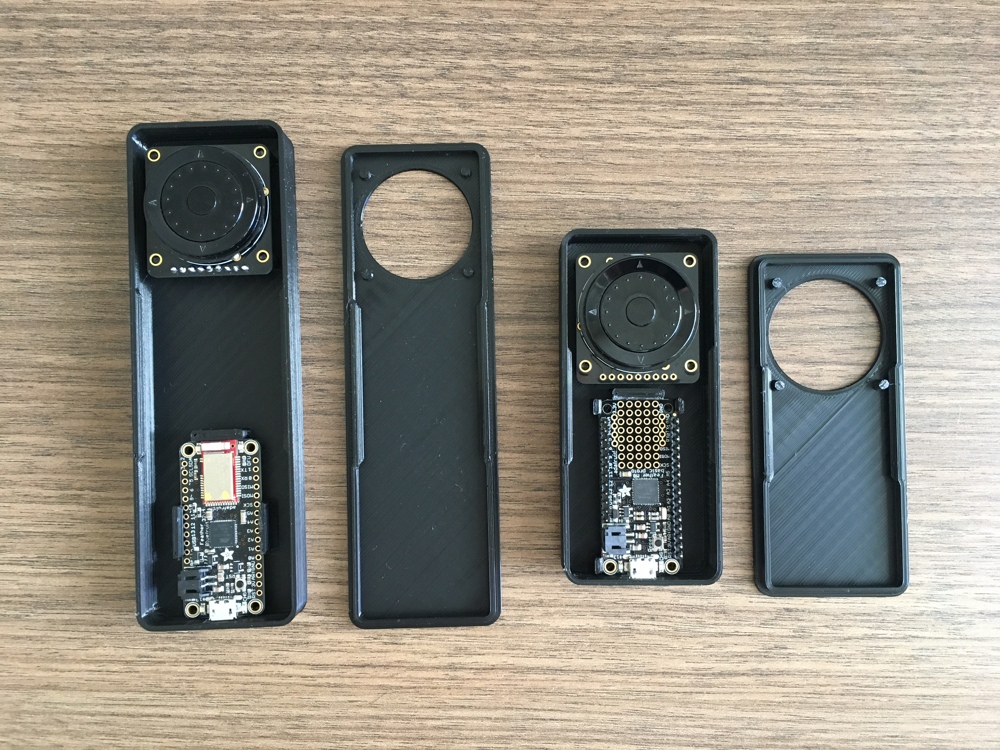
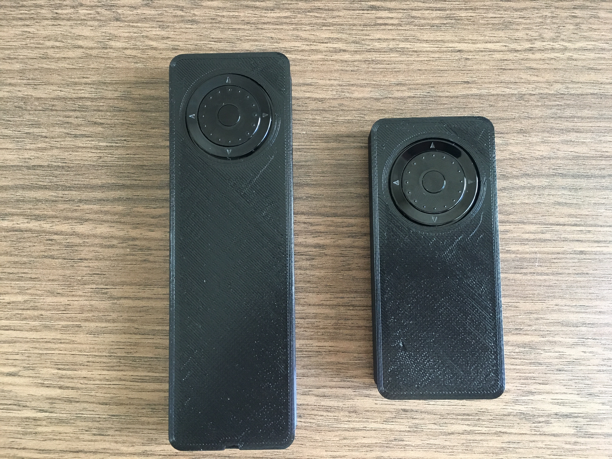

### Overview
This repository hosts a project of wheelencoder based stage controller.  
The encoder and its PCB are from adafruit, the product id is 5001 and 5221. 
The controller mcu could be Feather BLE 32u4 or arduino (with Arduino IDE and .ino scripts). 
Another controller could be a Feather M0 (with circuitpython implementation, in the .cicuitpyton/code.py). 
The computer end software to simulate stage behavior is realsimulator_2ndTry.py.

### Code description
"realsimulator_2ndTry.py" is the python script to animate the stage motion. 
It reads data from serial port. The data contains motion information (which
axis, moving step.Four points will be plot in a box (canvas). By rotating the 
encoder, one of the four points will be moved accordingly. 
"serialresponse.py" is the computer end python script to test if serial message from the 
MCU could be used and responded.

"circuitpython/code.py is the python code running on microcontroller (here is a dev
board, feather M0). It monitors the encoder. Four buttons at the outside of the 
encoder (left, up, right, down) can enable axis for x, y, z and rotation and switch 
between different axis. The button in the center could be used to switch the 
fine/coarse movements of the points. Then, it sends correponding information to serial 
port to work with the realsimulator_2ndTry.py. 

### Ref links:
- 1. [encoder datasheet](https://cdn-learn.adafruit.com/assets/assets/000/104/942/original/tsw.pdf?1633105183)
### Photo of the controller
</a>
</a>

### Notes: 
1. The recommended editor to work with circuitpython is Mu. Unforturnately,it is currently (checked May 4, 2022) does not install properly on Ubuntu 22.04. I think the main convinient-wise feature of Mu is the built-in serial console. So I am just using the default editor of ubuntu and write a very simple python script to listen to what the microcontroller is talking over the serial. The script is "serialread.py", it can be invoked in a terminal with "python3 serialread.py". All it is doing is to print anything it reads from the designated serial port/line. (update Jan-26 2023: 1. a command line application cu could do the serial commnunication job pretty well. 2. use shebang #！to specify script type for the shell could be another way to run the script. 
